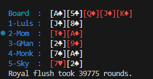

# PokerGame



PokerGame contains a Texas Hold 'Em Poker engine with a console interface.

## Table of Contents <!-- omit in toc -->

- [Quickstart](#quickstart)
- [Todo](#todo)
  - [Todo priority order](#todo-priority-order)

## Quickstart

Run the following command to trigger a base engine demo, whereby the engine runs through rounds of Poker until `Mom` wins with a Royal Flush:

```bash
$ make run
```

_Tip: `make` commands require a bash shell, (ex: [Git Bash](https://git-scm.com/install/windows) for Windows)._

## Todo

1. Fix and finalize game flow state machine

2. Track active players properly

   ```
   public bool IsFolded { get; set; }
   public int CurrentBet { get; set; }
   ```

3. Iplement player actions:
   - Fold
   - Check
   - Call
   - Raise

4. Implement betting round loop (CORE ENGINE)

### Todo priority order

1. BettingRound() engine ⭐ MOST IMPORTANT
2. Showdown logic
3. Blind logic
4. Turn order logic
5. Player input
6. AI players
7. Side pots (advanced)
8. All-in logic (advanced)
