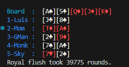

# PokerGame

[](https://github.com/yourusername/PokerGame)



PokerGame contains a Texas Hold 'Em Poker engine with a console interface.

## Table of Contents <!-- omit in toc -->

- [Quickstart](#quickstart)
- [Run tests](#run-tests)
- [Todo](#todo)
  - [Todo priority order](#todo-priority-order)

## Quickstart

Run the following command to trigger a base engine demo, whereby the engine runs through rounds of Poker until `Mom` wins with a Royal Flush:

```bash
$ make run
```

_Tip: `make` commands require a bash shell, (ex: [Git Bash](https://git-scm.com/install/windows) for Windows)._

## Run tests

Run the following command to trigger all unit tests:

```bash
$ make test
```

Run this command to trigger all unit tests, get a coverage console report, and update the coverage badge:

```bash
$ make coverage
```

## Todo

1. Design client/server architecture
Client -> Server: "PlayerAction: Call"
Server -> RoundEngine: Apply action
RoundEngine -> Server: Updated table state
Server -> Clients: Broadcast updated table state

### Todo priority order

1. Side pots (advanced)
2. All-in logic (advanced)
